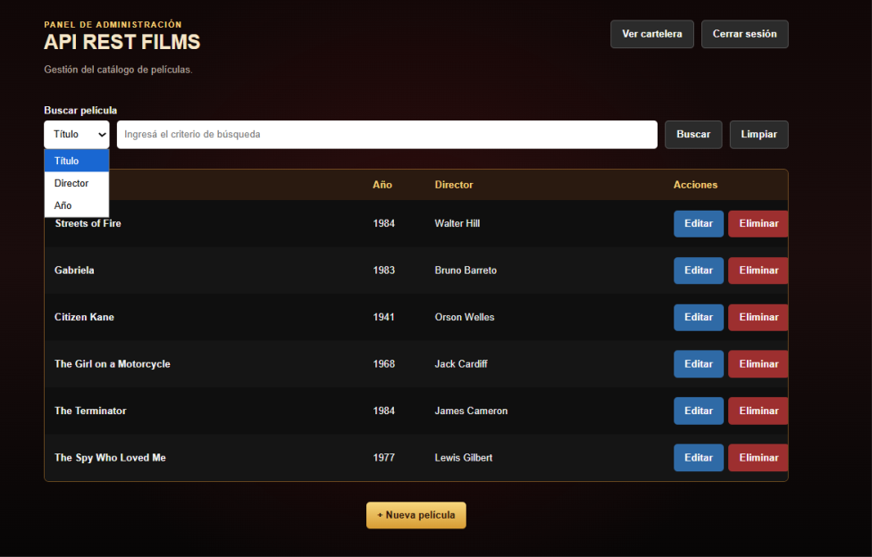

# API REST Films

Aplicación web desarrollada con **Node.js**, **Express** y **Firebase**, que permite registrar usuarios, autenticarse mediante JWT y acceder a un catálogo de películas almacenado en Cloud Firestore.

La aplicación implementa una arquitectura por capas (**Routes → Controllers → Services → Models**), autenticación mediante **Firebase Authentication**, autorización por roles (`viewer` y `admin`) y un frontend que consume la API utilizando `fetch()`.

---
## Demo

**Aplicación online:** https://api-rest-films-seven.vercel.app/

---

## Características principales

- Arquitectura por capas (Routes → Controllers → Services → Models).
- Firebase Authentication + Cloud Firestore.
- Autenticación mediante JWT.
- Roles de usuario (`viewer` / `admin`).
- Registro y verificación de correo electrónico.
- Recuperación de contraseña.
- Activación y desactivación de usuarios.
- Catálogo dinámico de películas.
- Reproductor integrado.
- Panel de administración.
- CRUD completo de películas desde la interfaz web.
- Despliegue en Vercel.

---

## Capturas de pantalla

### Inicio de sesión


### Registro


### Cartelera


### Ficha de película




---

## Tecnologías utilizadas

### Backend

- Node.js
- Express
- Firebase Authentication
- Firebase Admin SDK
- Cloud Firestore
- JSON Web Token (JWT)
- dotenv
- CORS

### Frontend

- HTML5
- CSS3
- JavaScript (ES6)

### Deploy

- Vercel

---

## Funcionalidades

### Usuarios

- Registro de nuevos usuarios con rol `viewer`.
- Inicio de sesión mediante Firebase Authentication.
- Verificación obligatoria del correo electrónico.
- Reenvío del correo de verificación.
- Recuperación de contraseña mediante email.
- Activación y desactivación de cuentas.
- Cierre automático de sesión para usuarios desactivados.
- Generación de JWT firmados por el servidor.
- Roles `viewer` y `admin`.

### Catálogo

- Catálogo dinámico obtenido desde Firestore.
- Página individual para cada película.
- Reproducción integrada de video.
- Búsqueda de películas.

### Administración

- Panel exclusivo para usuarios con rol `admin`.
- Listado dinámico de películas.
- Búsqueda por título, director o año.
- Alta de películas.
- Edición de películas.
- Eliminación con confirmación.
- Actualización automática del listado.

---

## Flujo de uso

1. El usuario crea una cuenta.
2. Firebase Authentication registra sus credenciales.
3. Se crea automáticamente su perfil en Firestore con rol `viewer`.
4. Firebase envía un correo de verificación.
5. El usuario verifica su dirección de correo electrónico.
6. Inicia sesión.
7. El servidor valida el usuario y genera un JWT.
8. El frontend utiliza el JWT para consumir la API.
9. El usuario accede al catálogo y a las películas.

Los usuarios con rol **admin** disponen además de acceso al panel de administración y pueden crear, modificar y eliminar películas.

Las cuentas marcadas como `active: false` no pueden iniciar sesión y pierden el acceso en su siguiente petición aunque dispongan de un JWT todavía vigente.

---

## Arquitectura

```text
Usuario
    │
    ▼
Frontend (HTML / CSS / JavaScript)
    │
    ▼
Express API
    │
    ▼
Middleware JWT
    │
    ▼
Controllers
    │
    ▼
Services
    │
    ▼
Models
    │
    ▼
Firebase Admin SDK
    │
    ▼
Cloud Firestore
```

---

## Estructura del proyecto

```text
api-rest-films/
│
├── controllers/
├── data/
├── middlewares/
├── models/
├── public/
│   ├── css/
    │   ├── admin.css
    │   ├── estilos.css
    │   └── login.css
│   ├── imagenes/
│   ├── js/
│   ├── videos/
    ├
│   ├── admin.html
    ├── film.html
    ├── forgot-password.html
    ├── index.html
    ├── login.html
    └── register.html
│
├── routes/
├── services/
├── utils/
├── assets/
│   └── screenshots/
├── index.js
├── package.json
└── .env
```

---

## Instalación

Clonar el repositorio:

```bash
git clone <URL_DEL_REPOSITORIO>
```

Instalar dependencias:

```bash
npm install
```

Crear un archivo `.env` con las variables correspondientes.

Ejecutar:

```bash
npm run start
```

Servidor:

```text
http://localhost:3000
```

---

## Variables de entorno

```text
FIREBASE_API_KEY=
FIREBASE_AUTH_DOMAIN=
FIREBASE_PROJECT_ID=
FIREBASE_STORAGE_BUCKET=
FIREBASE_MESSAGING_SENDER_ID=
FIREBASE_APP_ID=

FIREBASE_ADMIN_PROJECT_ID=
FIREBASE_ADMIN_CLIENT_EMAIL=
FIREBASE_ADMIN_PRIVATE_KEY=

JWT_SECRET_KEY=
```

---

## Endpoints principales

### Autenticación y usuarios

**POST** `/auth/register`

Registra un nuevo usuario con rol `viewer` y envía un correo de verificación.

**POST** `/auth/login`

Autentica al usuario y devuelve un JWT válido para acceder a la API.

**POST** `/auth/forgot-password`

Envía un correo electrónico para restablecer la contraseña.

**POST** `/auth/resend-verification`

Reenvía el correo de verificación de la cuenta.

---

### Películas

**GET** `/api/films`

Obtiene el catálogo completo de películas.

**GET** `/api/films/:id`

Obtiene una película por su identificador.

**GET** `/api/films/buscar`

Busca películas mediante parámetros de consulta (`title`, `director`, `year`).

**POST** `/api/films`

Crea una nueva película.

**PUT** `/api/films/:id`

Actualiza una película existente.

**DELETE** `/api/films/:id`

Elimina una película.

> Las operaciones **POST**, **PUT** y **DELETE** requieren autenticación y un usuario con rol `admin`.

---

## Modelo de datos

La aplicación utiliza dos colecciones principales en Cloud Firestore.

### Colección `films`

Cada documento representa una película y puede contener los siguientes campos:

- `title`
- `director`
- `year`
- `genre`
- `duration`
- `country`
- `rating`
- `synopsis`
- `image`
- `videoUrl`

Ejemplo:

```json
{
  "title": "Citizen Kane",
  "year": 1941,
  "director": "Orson Welles",
  "genre": "Drama",
  "duration": 119,
  "country": "Estados Unidos",
  "rating": 8.3,
  "synopsis": "...",
  "image": "/imagenes/citizen-kane.jpg",
  "videoUrl": "/videos/citizen-kane.mp4"
}
```

### Colección `users`

Cada documento contiene el perfil asociado a un usuario registrado:

- `email`
- `name`
- `role`
- `active`

El campo `role` determina los permisos del usuario (`viewer` o `admin`) y `active` permite habilitar o deshabilitar su acceso a la aplicación.

---

## Seguridad

- Firebase Authentication para validar las credenciales.
- Verificación obligatoria del correo electrónico.
- JWT firmado por el servidor.
- Middleware de autenticación para proteger la API.
- Middleware `requireAdmin` para las operaciones administrativas.
- Autorización basada en roles (`viewer` / `admin`).
- Verificación del estado `active` del usuario en las solicitudes autenticadas.
- Bloqueo de inicio de sesión para cuentas inactivas.
- Firestore accedido desde el backend mediante Firebase Admin SDK.
- Credenciales y secretos almacenados mediante variables de entorno.

---

## Estado actual

El proyecto se encuentra desplegado y funcional en Vercel, utilizando Cloud Firestore como base de datos.

Actualmente permite completar el flujo de registro, verificación de correo, autenticación y recuperación de contraseña de los usuarios. Las cuentas pueden tener roles `viewer` o `admin` y pueden ser desactivadas mediante su estado `active`.

Los usuarios autenticados pueden consultar el catálogo, acceder a la ficha individual de cada película y utilizar el reproductor integrado.

Los administradores disponen además de un panel protegido desde el cual pueden buscar, crear, editar y eliminar películas. Los cambios realizados desde este panel se reflejan directamente en Firestore.

El funcionamiento de ambos roles y las operaciones CRUD del panel de administración han sido probado también sobre la aplicación desplegada en Vercel.

---

## Próximas mejoras

- Gestión de usuarios desde el panel de administración.
- Gestión y subida de imágenes.
- Integración con almacenamiento externo para videos.
- Mejoras en la experiencia del reproductor.
- Personalización de los correos de autenticación.