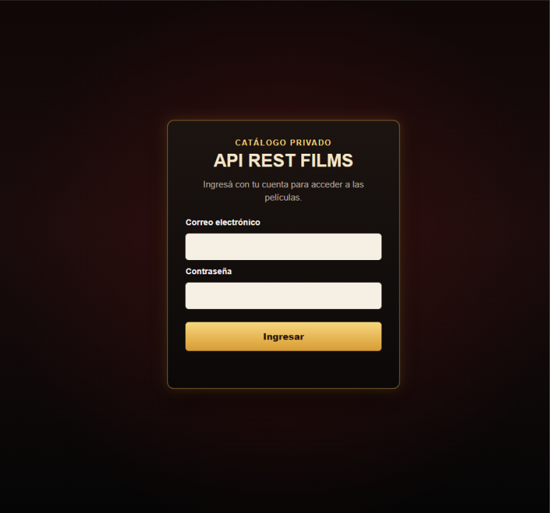
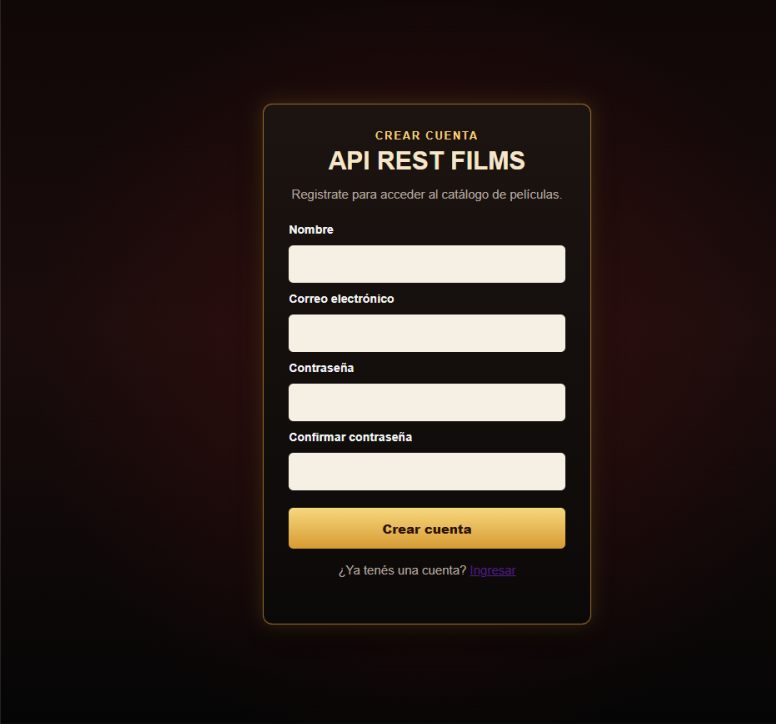
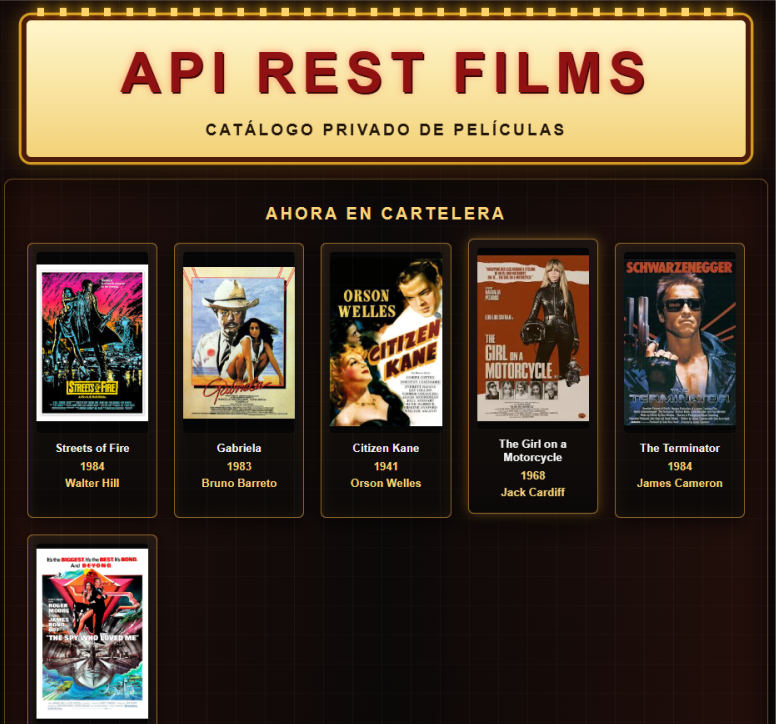
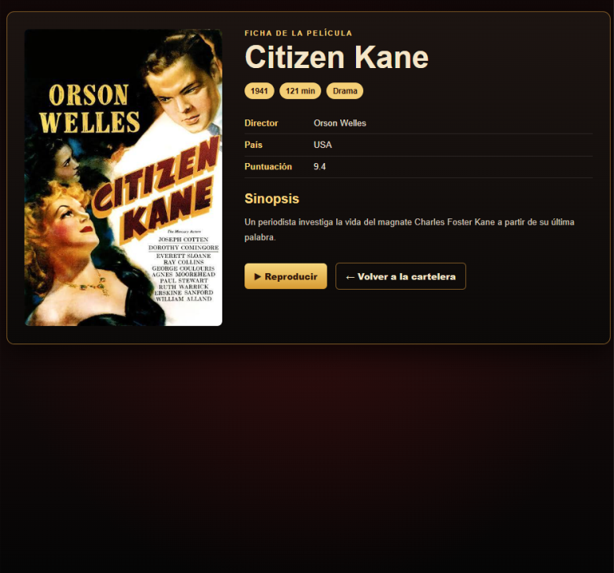

# API REST Films

Aplicación web desarrollada con **Node.js**, **Express** y **Firebase**, que permite registrar usuarios, autenticarse mediante JWT y acceder a un catálogo de películas almacenado en Cloud Firestore.

La aplicación implementa una arquitectura por capas (**Routes → Controllers → Services → Models**), autenticación mediante **Firebase Authentication**, autorización por roles (`viewer` y `admin`) y un frontend que consume la API utilizando `fetch()`.

---
## Demo

**Aplicación online:** https://api-rest-films-seven.vercel.app/

---

## Características principales

- Arquitectura por capas.
- Firebase Authentication + Cloud Firestore.
- Autenticación mediante JWT.
- Roles de usuario (`viewer` / `admin`).
- Catálogo dinámico de películas.
- Reproductor integrado.
- Despliegue en Vercel.

---

## Capturas de pantalla

### Inicio de sesión



### Registro



### Cartelera



### Ficha de película



---

## Tecnologías utilizadas

### Backend

- Node.js
- Express
- Firebase Authentication
- Firebase Admin SDK
- Cloud Firestore
- JSON Web Token (JWT)
- dotenv
- CORS

### Frontend

- HTML5
- CSS3
- JavaScript (ES6)

### Deploy

- Vercel

---

## Funcionalidades

- Registro de usuarios.
- Login mediante Firebase Authentication.
- Generación de JWT firmados por el servidor.
- Protección de rutas mediante middleware.
- Catálogo dinámico obtenido desde Firestore.
- Página individual para cada película.
- Reproducción integrada de video.
- Gestión centralizada de autenticación mediante JWT.

---

## Flujo de uso

1. El usuario crea una cuenta.
2. Se registra en Firebase Authentication.
3. Se crea automáticamente su perfil en Firestore.
4. Inicia sesión.
5. El servidor genera un JWT.
6. El frontend consume la API autenticada.
7. El usuario accede al catálogo.

Los usuarios con rol **admin** disponen de permisos para administrar las películas.

---

## Arquitectura

```text
Usuario
    │
    ▼
Frontend (HTML / CSS / JavaScript)
    │
    ▼
Express API
    │
    ▼
Middleware JWT
    │
    ▼
Controllers
    │
    ▼
Services
    │
    ▼
Models
    │
    ▼
Firebase Admin SDK
    │
    ▼
Cloud Firestore
```

---

## Estructura del proyecto

```text
api-rest-films/
│
├── controllers/
├── data/
├── middlewares/
├── models/
├── public/
│   ├── css/
│   ├── imagenes/
│   ├── js/
│   ├── videos/
│   ├── film.html
│   ├── index.html
│   ├── login.html
│   └── register.html
│
├── routes/
├── services/
├── utils/
├── assets/
│   └── screenshots/
├── index.js
├── package.json
└── .env
```

---

## Instalación

Clonar el repositorio:

```bash
git clone <URL_DEL_REPOSITORIO>
```

Instalar dependencias:

```bash
npm install
```

Crear un archivo `.env` con las variables correspondientes.

Ejecutar:

```bash
npm run start
```

Servidor:

```text
http://localhost:3000
```

---

## Variables de entorno

```text
FIREBASE_API_KEY=
FIREBASE_AUTH_DOMAIN=
FIREBASE_PROJECT_ID=
FIREBASE_STORAGE_BUCKET=
FIREBASE_MESSAGING_SENDER_ID=
FIREBASE_APP_ID=

FIREBASE_ADMIN_PROJECT_ID=
FIREBASE_ADMIN_CLIENT_EMAIL=
FIREBASE_ADMIN_PRIVATE_KEY=

JWT_SECRET_KEY=
```

---

## Endpoints principales

### Registro

**POST** `/auth/register`

Crea un nuevo usuario con rol **viewer**.

---

### Autenticación

**POST** `/auth/login`

Devuelve un JWT válido para acceder a la API.

---

### Películas

**GET** `/api/films`

Obtiene el catálogo completo.

**GET** `/api/films/:id`

Obtiene una película por su identificador.

**GET** `/api/films/buscar`

Busca películas utilizando parámetros de consulta (`title`, `director`, `year`).

**POST** `/api/films`

Crea una nueva película.

**PUT** `/api/films/:id`

Actualiza una película existente.

**DELETE** `/api/films/:id`

Elimina una película.

> Las operaciones **POST**, **PUT** y **DELETE** requieren un usuario con rol **admin**.

---

## Modelo de datos

### Colección `films`

- title
- director
- year
- genre
- duration
- country
- rating
- synopsis
- image
- videoUrl

### Colección `users`

- email
- name
- role
- active

Ejemplo de documento:

```json
{
  "title": "Citizen Kane",
  "year": 1941,
  "director": "Orson Welles",
  "genre": "Drama",
  "duration": 119,
  "country": "Estados Unidos",
  "rating": 8.3,
  "synopsis": "...",
  "image": "/imagenes/citizen-kane.jpg",
  "videoUrl": "/videos/citizen-kane.mp4"
}
```

---

## Seguridad

- Firebase Authentication para validar usuarios.
- JWT firmado por el servidor.
- Middleware de autenticación.
- Middleware `requireAdmin`.
- Firestore accedido exclusivamente mediante Firebase Admin SDK.
- Variables de entorno para proteger credenciales.

---

## Estado actual

### Funcionalidades implementadas

#### Usuarios

- Registro.
- Inicio de sesión.
- Autenticación mediante Firebase Authentication.
- Roles (`viewer` / `admin`).

#### Películas

- Consulta del catálogo.
- Consulta individual.
- Búsqueda.
- Alta.
- Modificación.
- Eliminación.

#### Frontend

- Login.
- Registro.
- Cartelera dinámica.
- Ficha individual.
- Reproductor integrado.

#### Despliegue

- Aplicación desplegada en Vercel.
- Base de datos alojada en Cloud Firestore.

---

## Próximas mejoras

- Panel de administración (`admin.html`).
- CRUD completo desde la interfaz web.
- Gestión de imágenes de las películas.
- Integración con almacenamiento externo para videos.
- Recuperación de contraseña.
- Verificación de correo electrónico.